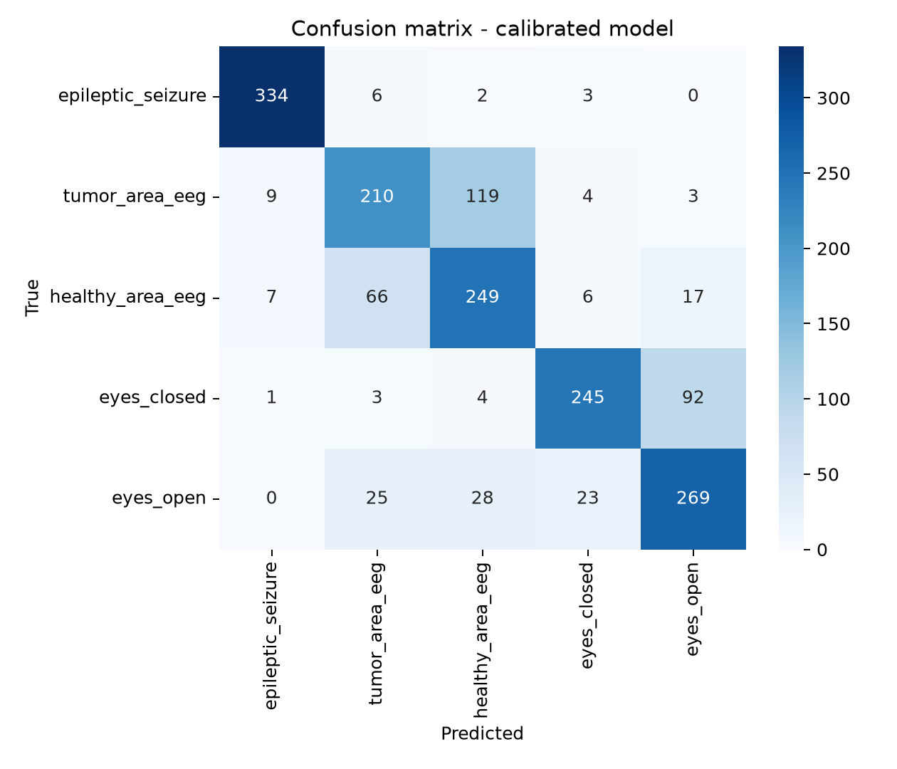
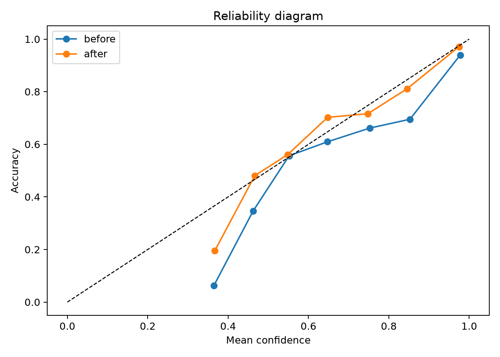
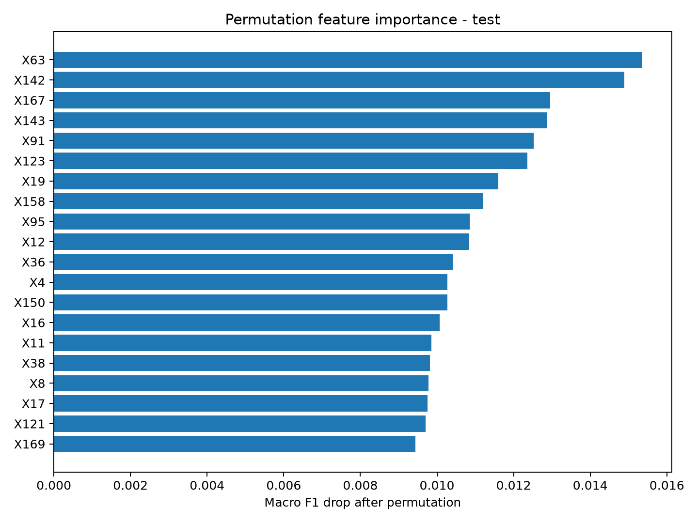

# EEG Multiclass Classification with PyTorch Lightning, Calibration, and XAI

This project implements an end-to-end multiclass EEG classification workflow
covering preprocessing, hyperparameter optimization, calibration, uncertainty
estimation, and explainability.

The classifier is a PyTorch Lightning multilayer perceptron trained on the
public Epileptic Seizure Recognition dataset. The repository includes the
reproducible training pipeline, refreshed evaluation artifacts, fast tests, and
GitHub Actions CI.

## Project Scope

The workflow covers:

1. Data loading, cleaning, stratified splitting, outlier clipping, and scaling.
2. Exploratory analysis of EEG signal shape, energy, class balance, and PCA.
3. Optuna hyperparameter optimization with 30 trials.
4. Final PyTorch Lightning model training with the selected configuration.
5. Temperature scaling on the validation set.
6. Test-set evaluation, uncertainty analysis, and calibrated predictions.
7. Permutation feature importance and LIME explanations for explicit predicted classes.

## Dataset

The project uses the public Kaggle dataset:

[Epileptic Seizure Recognition](https://www.kaggle.com/datasets/harunshimanto/epileptic-seizure-recognition)

| Property | Value |
|---|---:|
| Samples | 11,500 |
| Signal features | 178 |
| Target classes | 5 |
| Samples per class | 2,300 |
| Missing values | 0 |
| Duplicates | 0 |

Each observation is a short EEG segment represented by 178 consecutive signal
amplitudes:

```text
EEG segment -> 178 time points -> one EEG state label
```

| Raw class | Model target | Meaning |
|---:|---:|---|
| 1 | 0 | `epileptic_seizure` |
| 2 | 1 | `tumor_area_eeg` |
| 3 | 2 | `healthy_area_eeg` |
| 4 | 3 | `eyes_closed` |
| 5 | 4 | `eyes_open` |

Because `X1` to `X178` are ordered time points, model explanations should be
read as important signal positions or signal segments, not independent clinical
variables.

## Repository Structure

```text
.
|-- EEG_project_presentation.ipynb      # Notebook showcase using src modules
|-- README.md                           # Project documentation
|-- LICENSE                             # MIT license
|-- pyproject.toml                      # Ruff and pytest configuration
|-- requirements.txt                    # Runtime, notebook, and CI dependencies
|-- .github/workflows/ci.yml            # Ruff, pytest, and compileall CI
|-- data/
|   `-- README.md                       # Data source and preprocessing notes
|-- src/
|   |-- data.py                         # Loading, cleaning, splitting, scaling
|   |-- model.py                        # Lightning DataModule and MLP model
|   |-- train.py                        # Reproducible end-to-end pipeline
|   |-- evaluation.py                   # Metrics, reports, confusion matrix
|   |-- calibration.py                  # Temperature scaling and calibration metrics
|   `-- xai.py                          # PFI and LIME utilities
|-- tests/                              # Fast unit tests for CI
`-- outputs/
    |-- figures/                        # EDA, evaluation, calibration, XAI plots
    |-- lime/                           # Local LIME HTML explanations
    |-- metrics/                        # Test metrics and classification report
    |-- models/                         # Small JSON configs tracked; weights ignored
    `-- tables/                         # HPO, predictions, uncertainty, PFI, LIME tables
```

## Methodology

Preprocessing in `src/data.py`:

- validates the raw schema before modeling:
  `X1` through `X178` in order, numeric feature values, no missing values, and
  target labels exactly in `{1, 2, 3, 4, 5}`,
- removes technical `Unnamed*` identifier columns,
- removes duplicate rows,
- maps labels from `1-5` to `0-4`,
- creates a stratified `70/15/15` train/validation/test split,
- computes `0.001` and `0.999` clipping bounds on the training set only,
- fits `StandardScaler` on the training set only,
- applies the same clipping and scaling parameters to validation and test sets.

The model in `src/model.py` is a multilayer perceptron:

```text
178 EEG time points
-> Linear + BatchNorm + ReLU + Dropout
-> Linear + BatchNorm + ReLU + Dropout
-> Linear + BatchNorm + ReLU + Dropout
-> Linear output layer with 5 classes
```

Training uses AdamW, `ReduceLROnPlateau`, early stopping on validation macro F1,
and deterministic seeding. Validation macro F1 is accumulated with
`torchmetrics.MulticlassF1Score`, so the scheduler, checkpointing, early
stopping, and Optuna objective use one epoch-level macro F1 value over the full
validation split.

## Hyperparameter Optimization

The final run uses a fixed seed (`42`) and 30 Optuna trials. The HPO cache is
used only when `outputs/models/hpo_config.json` matches the requested seed,
batch size, trial count, epoch count, dataset SHA-256, preprocessing config,
search space, and objective version. All trials are
stored in:

```text
outputs/tables/hyperparameter_search.csv
```

Best validation macro F1 from HPO:

```text
0.746493935585022
```

Selected hyperparameters:

```json
{
  "dropout": 0.2,
  "learning_rate": 0.0010672112706919764,
  "weight_decay": 0.00010323015857001449,
  "hidden_dims": [512, 256, 128]
}
```

The selected configuration is tracked in:

```text
outputs/models/best_params.json
outputs/models/hpo_config.json
outputs/models/run_config.json
```

## Results

Final test metrics from `outputs/metrics/test_metrics.csv`:

| Stage | Accuracy | Balanced Accuracy | Macro F1 | Weighted F1 | Macro OVR AUROC | NLL | Brier | ECE |
|---|---:|---:|---:|---:|---:|---:|---:|---:|
| Before calibration | 0.725 | 0.725 | 0.728 | 0.728 | 0.941 | 0.630 | 0.361 | 0.054 |
| After calibration | 0.725 | 0.725 | 0.728 | 0.728 | 0.941 | 0.605 | 0.355 | 0.027 |

Class-level F1 scores from `outputs/metrics/classification_report.csv`:

| Class | F1 score |
|---|---:|
| `epileptic_seizure` | 0.949 |
| `tumor_area_eeg` | 0.592 |
| `healthy_area_eeg` | 0.611 |
| `eyes_closed` | 0.779 |
| `eyes_open` | 0.711 |

The model performs best on epileptic seizure segments, which is consistent with
EDA showing a more distinctive amplitude and energy profile for that class. The
hardest distinction remains tumor-area EEG vs. healthy-area EEG from patients
with tumors.

## Figures







## Key Artifacts

| Path | Description |
|---|---|
| `src/train.py` | End-to-end reproducible pipeline |
| `outputs/metrics/test_metrics.csv` | Final metrics before and after calibration |
| `outputs/metrics/classification_report.csv` | Per-class precision, recall, and F1 |
| `outputs/tables/hyperparameter_search.csv` | All 30 Optuna trials |
| `outputs/models/best_params.json` | Selected Optuna configuration |
| `outputs/models/hpo_config.json` | HPO cache key and objective definition |
| `outputs/models/run_config.json` | Seed, HPO settings, batch size, temperature |
| `outputs/figures/confusion_matrix.png` | Final confusion matrix |
| `outputs/figures/reliability_diagram.png` | Calibration plot |
| `outputs/tables/pfi_test.csv` | Test-set permutation feature importance |
| `outputs/tables/lime_global.csv` | Aggregated LIME ranking for predicted-class explanations |
| `outputs/lime/` | Local LIME explanations with sample, predicted class, and true class context |

Model weights, Lightning checkpoints, fitted scalers, and calibration joblib
files are generated locally and intentionally ignored by Git. This keeps the
repository lightweight while preserving the code and small JSON configs needed
to reproduce them.

## Reproducibility

Tested with Python 3.10 and 3.11. The local validation in this workspace also
passed on Python 3.12.

Create and activate a virtual environment:

```powershell
python -m venv .venv
.\.venv\Scripts\Activate.ps1
pip install -r requirements.txt
```

Run the full pipeline:

```powershell
python -m src.train --seed 42 --n-trials 30 --max-epochs 35 --force-hpo
```

Run the fast quality checks:

```powershell
ruff check .
pytest
python -m compileall src tests
```

## Notebook

`EEG_project_presentation.ipynb` is kept as a readable project walkthrough. The
production logic lives in `src/`, and the notebook imports those modules instead
of owning the pipeline implementation.

## Limitations

This project is not a clinical diagnostic system. The public CSV dataset does
not provide full patient/session metadata, so random splitting may mix samples
that are not fully independent at the patient level. XAI results should be
interpreted as signal-level evidence within this dataset and model, not direct
neurophysiological conclusions.
